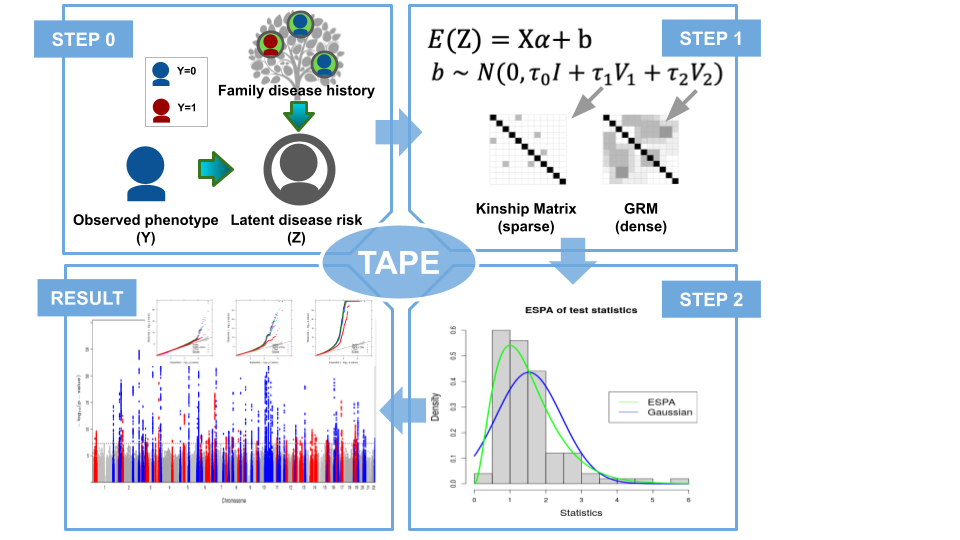

# TAPE

<p align="center">
<!-- badges: start -->


[](https://doi.org/10.1093/bioinformatics/btac459)
<!-- badges: end -->  
</p>

In this repository you can find all codes for the paper [**Incorporating family disease history and controlling case-control imbalance for population based genetic association studies**](https://doi.org/10.1093/bioinformatics/btac459). 

# Table of Contents
1. [Updates](#updates)
2. [Introduction](#introduction)
3. [Citation](#citation)
4. [Installation](#installation)
5. [Example](#example)
6. [Biobank analysis results](#biobank-analysis-results)  

## Updates  
2021-06-20 v0.3.0 Faster testing procedure with GRAB integration (bgen format only)  
2021-01-27 v0.2.1 Pilot release  

## Introduction  

Test with Adjusted Phenotype and Empirical saddlepoint approximation in linear mixed model (TAPE) uses adjusted phenotype capable of differentiating various family disease history configurations, and controls for case-control imbalance by empirical saddlepoint approximation. In addition to genetic relatedness, TAPE further accounts for sparse close relatedness in the variance component model to control for type I error rates.  

  

## Citation


```
Yongwen Zhuang, Brooke N Wolford, Kisung Nam, Wenjian Bi, Wei Zhou, Cristen J Willer, Bhramar Mukherjee, Seunggeun Lee, Incorporating family disease history and controlling case–control imbalance for population-based genetic association studies, Bioinformatics, 2022;, btac459, https://doi.org/10.1093/bioinformatics/btac459
```

## Installation

You can install the development version of TAPE from [Github](https://github.com/styvon/TAPE) with:

``` r
devtools::install_github("styvon/TAPE",ref="main")
library(TAPE)
```

## Example   

#### 1. Input data  
Items 1-3 are for Step 1, Items 4-5 are for Step 2.  

``` r
# 1. Path to data frame including covariates and adjusted phenotype
file_cova = system.file("extdata", "example_cova.txt", package = "TAPE") 
# 2. Path to sparse matrix for close relatedness
file_kmat = system.file("extdata", "example_kmat.rds", package = "TAPE") 
# 3. Path to PLINK file to construct the Genetic relatedness matrix (also used for variance ratio calculation in example)
file_geno_grm = tools::file_path_sans_ext(system.file("extdata", "example_geno_grm.bim", package = "TAPE")) 

# 4. Genotype file for testing, if bgen format, include bgi file too
file_geno_test = tools::file_path_sans_ext(system.file("extdata", "example_geno_test.bgen", package = "TAPE"))
file_bgi_test = system.file("extdata", "example_geno_test.bgi", package = "TAPE")
# 5. Path to file with a column of IIDs in genotype file
file_idsingeno = system.file("extdata", "example_idsingeno.txt", package = "TAPE")
```

#### 2. Output Specification  
Step 1 will generate a file of variance ratio information from sample markers; Step 2 will generates a summary file of test results.  
``` r
file_output_s1 = paste0(dirname(file_cova),"/output_s1") # change this to your path for output file for step 2
file_output_s2 = paste0(dirname(file_cova),"/output_s2.txt") # change this to your path for output file for step 3
file_output_s2M = paste0(dirname(file_cova),"/output_s2M.txt") # change this to your path for output file for step 3
```

#### 3. Phenotype adjustment (Step 0)  
TAPE allows for flexible choice of outcome variables. Phenotypes are adjusted using inferred risk of individuals, which can be calculated from either the formula in TAPE manuscript or other approaches like GWAX and LT-FH. In the sample code below, adjusted phenotype is stored in column `y` of the covariate file.  

#### 4. Null model estimation (Step 1)  
``` r
data = read.table(file_cova,header=T)
kmat = readRDS(file_kmat)

# 2-variance-component
obj_null <- TAPE_Null_Model(y ~ sex+age, data = data, K=kmat, KgenFile=file_geno_grm, VRgenFile = file_geno_grm, idstoIncludeFile=file_idsingeno, tau=rep(0,3),fixtau=rep(0,3),outFile=file_output_s1, verbose=T)
# 2-variance-component LOCO
obj_null_loco <- TAPE_Null_Model(y ~ sex+age, data = data, K=kmat, KgenFile=file_geno_grm, VRgenFile = file_geno_grm, idstoIncludeFile=file_idsingeno, tau=rep(0,3),fixtau=rep(0,3),outFile=file_output_s1, verbose=T, loco=T)
# 1-variance-component (w/o sparse kinship )
obj_null_nok <- TAPE_Null_Model(y ~ sex+age, data = data, K=NULL, KgenFile=file_geno_grm, VRgenFile = file_geno_grm, idstoIncludeFile=file_idsingeno, tau=rep(0,2),fixtau=rep(0,2),outFile=file_output_s1, verbose=T)
```

#### 4. Score test (Step 2)
``` r
# slow version
n_variants_tested = TAPEtest(null_object=obj_null, genfile=file_geno_test, samplefile=file_idsingeno, outfile=file_output_s2, genfile_format="bgen", bgi_file="1")

# faster version (GRAB integration), only applicable to bgen format
n_variants_tested = TAPEtestM(null_object=obj_null, genfile=file_geno_test, samplefile=file_idsingeno, outfile=file_output_s2M, genfile_format="bgen", bgi_file="1")
```

More details can be found in documentation and the workflow vignette:  
``` r
vignette("workflow")
```

## Biobank analysis results
See [here](https://github.com/styvon/TAPE/blob/main/vignettes/biobank_results.md) for details
